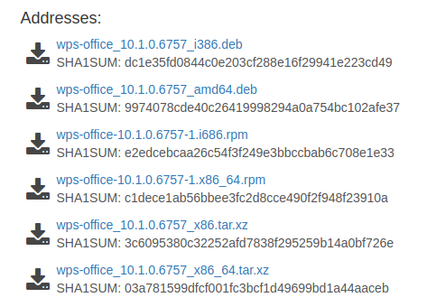

* [Uninstall LibreOffice](#uninstall-libreoffice)
* [Install WPS office](#install-wps-office)

***

# Uninstall LibreOffice

Open terminal by using following shortcut <kbd>Ctrl+Alt+t</kbd>, if you do not knew how to do so. 
Then type following lines in terminal window which will remove all packages related to libreoffice.


sudo apt-get remove --purge libreoffice*
sudo apt-get clean
sudo apt-get autoremove


# Install WPS office

Open your browser and navigate to following [downloads page](http://wps-community.org/downloads).
Choose proper debian package from "Addresses" section for your Ubuntu installation architecture and download it.

> If you do not knew what is your Ubuntu installation architecture type following in your browser **uname -i**.
> You should see something like this in terminal output **x86_64**. It means your installation architecture
> is 64 bit. So you should select *wps-office_10.1.0.6757_amd64.deb*

In terminal window navigate to directory where you saved your file using `cd` command. In my case it is
**Downloads** directory under user's home directory. Then type following command:


cd ~/Downloads
sudo dpkg -i wps-office_10.1.0.6757_amd64.deb


If you noticied in order to install WPS office you need super user permissions. After executing last command
wait until it will compleates and then you can start using WPS office.
